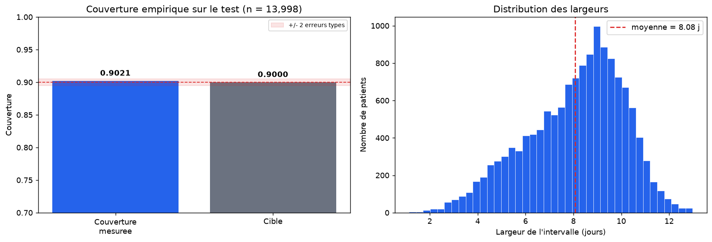
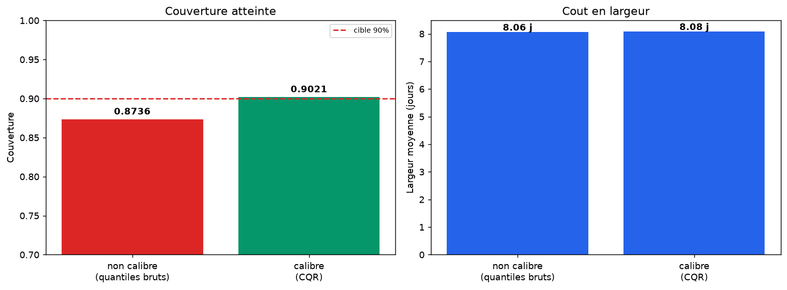
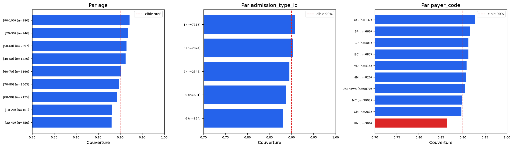

# MedStay-CI

[](https://github.com/eddy-decastro/MedStay/actions/workflows/ci.yml)
[](https://medstay.onrender.com)
[](https://www.python.org/)
[](LICENSE)

**Prédiction de durée de séjour hospitalier avec intervalles garantis à 90 %.**

> **Démo en ligne : [medstay.onrender.com](https://medstay.onrender.com)**
> Service gratuit : il s'endort après 15 min d'inactivité, comptez 30 à 50 s au
> premier chargement.

---

## Le problème

Un hôpital doit anticiper l'occupation de ses lits. Un modèle classique répond
« 4,2 jours » — sans dire à quel point il en est sûr.

Or ce chiffre seul est inexploitable. Deux patients identiques sur le papier
peuvent séjourner 2 ou 9 jours selon des événements imprévisibles à
l'admission. Un gestionnaire de lits qui planifie sur « 4,2 » se trompera
systématiquement, sans jamais savoir de combien.

Ce projet répond autrement : **« entre 2 et 8 jours, et cette affirmation est
juste 90 fois sur 100 »**. La garantie est mathématique, mesurée, et
l'intervalle s'élargit tout seul quand le cas est difficile.

## Le résultat

| | |
|---|---|
| **Couverture visée** | 90,00 % |
| **Couverture mesurée sur le test** | **90,21 %** |
| Écart à la cible | +0,84 erreur type — dans le bruit statistique |
| Largeur moyenne d'intervalle | 8,08 jours |
| Patients de test (jamais vus) | 13 998 |

La promesse est tenue. Et elle l'est **à tous les niveaux de confiance**, pas
seulement à 90 % : sur 11 niveaux testés de 50 % à 99 %, l'écart absolu moyen
entre couverture visée et obtenue est de **0,0024**.



## Ce qu'apporte la prédiction conforme

C'est la démonstration centrale du projet. Sans calibration, les quantiles
bruts des modèles ne couvrent que **87,4 %** au lieu des 90 % annoncés — un
modèle quantile est systématiquement trop optimiste, parce qu'il est ajusté sur
ses propres données d'entraînement.

La correction conforme ramène la couverture à **90,2 %** pour une largeur
d'intervalle quasi identique : **8,06 → 8,08 jours**.

> **+2,85 points de couverture pour +0,02 jour de largeur.** La garantie ne
> coûte pratiquement rien.



## Comment ça marche

```
1. Deux LightGBM apprennent des BORNES (quantiles 0,05 et 0,95), pas une valeur.
2. Ces bornes sont trop étroites : elles sont ajustées sur le train.
3. Sur un jeu JAMAIS VU (calibration), on mesure de combien elles se trompent.
4. On les élargit exactement de cette marge.
5. Garantie : aucune hypothèse de loi de probabilité n'est requise.
```

La seule condition est l'**échangeabilité** des observations — que les patients
futurs ressemblent statistiquement aux patients passés. C'est pourquoi la
déduplication par patient (§ Méthodologie) n'était pas négociable.

## Architecture

```
                    ┌─────────────────────────────┐
                    │   GitHub (repo public)      │
                    │   push main                 │
                    └──────┬───────────────┬──────┘
                           │               │ webhook
              GitHub Actions CI            ▼ (après CI verte)
           ruff + pytest + build  ┌────────────────────────────────────┐
              (quality gate)      │   Render — web service Docker      │
                                  │                                    │
                                  │  ┌───────────┐  HTTP  ┌─────────┐  │
                                  │  │ Streamlit │ ─────► │ FastAPI │  │
                                  │  │  $PORT    │        │  8000   │  │
                                  │  │ (exposé)  │ ◄───── │(interne)│  │
                                  │  └───────────┘  JSON  └────┬────┘  │
                                  │      lancés par start.sh   │       │
                                  │                    ┌───────▼─────┐ │
                                  │                    │ cqr_model   │ │
                                  │                    │ .joblib     │ │
                                  │                    └─────────────┘ │
                                  └────────────────────────────────────┘

Hors ligne (local) :
CSV UCI ─► preprocess ─► split 60/20/20 ─► LightGBM quantiles (train)
        ─► calibration CQR (calib) ─► validation (test) ─► export joblib
```

**Le front ne charge jamais le modèle.** Il ne parle à l'API qu'en HTTP. On
pourrait remplacer le front par une application mobile, ou l'API par un autre
modèle, sans toucher à l'autre moitié.

**Le déploiement est bloqué sur une CI verte** : Render est configuré en
`Auto-Deploy: After CI checks pass`. Un commit qui casse les tests n'atteint
jamais la production.

## Choix de modèle, justifié par la mesure

Comparaison en validation croisée 5 folds sur le train uniquement :

| Modèle | MAE | RMSE | R² | Temps | Catégorielles |
|---|---|---|---|---|---|
| **LightGBM** | **2,057** | **2,691** | **+0,159** | 3,5 s | natives |
| XGBoost | 2,060 | 2,697 | +0,155 | 3,9 s | natives |
| Réseau de neurones (64, 32) | 2,083 | 2,717 | +0,142 | 18,1 s | one-hot + scaling |
| Random Forest | 2,131 | 2,754 | +0,119 | 5,4 s | one-hot |
| Naïf (médiane) | 2,220 | 3,199 | −0,189 | — | — |

LightGBM gagne, mais **l'écart avec XGBoost (0,0035 de R²) est du bruit**. Le
vrai argument est ailleurs :

1. **`objective='quantile'` natif** — décisif. Ni le MLP ni Random Forest n'ont
   d'objectif quantile : avec eux, la CQR telle qu'implémentée ici est
   impossible.
2. **19 colonnes contre 175.** Sans support catégoriel natif, le one-hot
   multiplie la largeur de la matrice par 9,2 (`medical_specialty` pèse à elle
   seule 71 colonnes).
3. **Aucun pipeline de préparation** à écrire, tester et maintenir.
4. **5× plus rapide que le MLP** sur CPU, ce qui compte avec 512 Mo de RAM.

## Méthodologie — quatre décisions qui comptent

### 1. Uniquement des variables connues à l'admission

Le modèle sert à anticiper l'occupation des lits **au moment où le patient
arrive**. Toute variable renseignée plus tard est inutilisable en pratique,
même si elle améliore les métriques.

Écartées : `discharge_disposition_id` et `readmitted` (postérieures à la
sortie), puis `num_medications` (r = +0,47), `num_lab_procedures` (r = +0,33),
`num_procedures` et les 21 colonnes de médicaments — toutes mesurées **pendant**
le séjour. Un séjour long génère mécaniquement plus de prescriptions : ces
variables reflètent la durée bien plus qu'elles ne la prédisent.

**Coût assumé : 49 → 20 colonnes, métriques plus faibles, intervalles plus
larges.** Un test verrouille la règle et casse la CI si une variable postérieure
à l'admission est réintroduite.

### 2. Une seule admission par patient

La prédiction conforme suppose des observations **échangeables**, donc
indépendantes. Un même patient présent à la fois dans le train et dans le set de
calibration rendrait la couverture mesurée optimiste — le modèle l'aurait déjà
vu. On garde la première admission : **29,7 % des lignes écartées**, le coût le
plus lourd du pipeline.

### 3. Exclusion des décès et soins palliatifs

2,4 % des séjours se terminent par un décès ou des soins palliatifs
(`discharge_disposition_id` ∈ {11, 13, 14, 19, 20, 21}). Leur durée est
déterminée par le décès, pas par la guérison : ce n'est pas le même phénomène.
Les garder reviendrait à entraîner le modèle sur deux réalités distinctes sous
une même étiquette.

### 4. `payer_code` conservé, pas écarté

Le code d'assurance est un proxy de statut socio-économique. Le retirer ne
supprimerait pas l'inégalité d'accès aux soins — cela la rendrait **invisible**,
le modèle la reconstruisant via des proxys (âge, spécialité, diagnostics) sans
qu'on puisse plus la mesurer.

La variable est donc conservée, et la couverture est **vérifiée par catégorie
d'assurance** (figure ci-dessous). Mesurer plutôt qu'esquiver.

## Validation par sous-groupe — et sa limite



**Limite théorique importante, à énoncer clairement :** la prédiction conforme
split ne garantit que la couverture **marginale**, moyennée sur toute la
population. Rien n'assure qu'elle soit atteinte dans chaque sous-groupe.

C'est ce qu'on observe : la couverture varie de **86,4 %** (assurance `UN`) à
**92,7 %** selon les sous-groupes, soit 6,3 points d'écart pour une garantie
globale de 90,2 %. Ce n'est pas un défaut d'implémentation, c'est une propriété
connue de la méthode. Obtenir une couverture conditionnelle exigerait des
approches plus lourdes (Mondrian conformal prediction).

## Reproduire

```bash
uv venv && source .venv/bin/activate
uv pip install -r requirements.txt -r requirements-dev.txt

python -m src.data.load          # télécharge le dataset UCI (19,5 Mo)
python -m src.data.preprocess    # nettoyage + features
python -m src.data.split         # split 60/20/20, calculé UNE FOIS
python -m src.models.train       # baseline LightGBM L2
python -m src.models.calibrate   # quantiles + calibration CQR
python -m src.models.evaluate    # validation statistique + figures
python -m src.models.benchmark   # comparaison des 5 modèles

pytest --cov=src                 # 99 tests
ruff check . && ruff format .
```

Lancer l'application en local :

```bash
docker compose up
```

Ou sans Docker, dans deux terminaux :

```bash
uvicorn src.api.main:app --reload --port 8000
streamlit run app/streamlit_app.py
```

## API

Documentation interactive : `/docs` (OpenAPI générée par FastAPI).

| Route | Description |
|---|---|
| `GET /health` | Sonde de vie |
| `GET /model-info` | Métadonnées + couverture **réellement mesurée** |
| `GET /categories` | Modalités acceptées par le modèle |
| `POST /predict` | Un patient, `alpha` optionnel dans [0,01 ; 0,50] |
| `POST /predict/batch` | Jusqu'à 1000 patients |

```json
{
  "point_estimate": 4.54,
  "lower_bound": 1.08,
  "upper_bound": 10.37,
  "interval_width": 9.29,
  "coverage_level": 0.9
}
```

## Tests

**99 tests**, dont les propriétés métier qui protègent la cohérence des
intervalles :

- `lower ≤ point ≤ upper` — **réellement violée sur 0,3 % des cas** avant
  correction : les trois quantiles sont appris indépendamment et la correction
  conforme décale les bornes sans décaler la médiane.
- Largeur strictement positive, bornes dans [1, 14].
- **α plus petit ⇒ intervalle plus large** — traduction directe de la garantie.
- Déterminisme, disjonction des splits, absence de variable postérieure à
  l'admission, 15 cas de validation 422.

## Limites connues

- **Données de 1999 à 2008**, 130 hôpitaux américains. Les pratiques cliniques
  et les durées de séjour ont changé depuis.
- **Couverture marginale seulement** — voir la section sous-groupes. Certains
  descendent à 86,4 %.
- **Aucune validation clinique.** Projet pédagogique, jamais éprouvé en
  conditions réelles. À ne pas utiliser pour une décision de soin.
- **Échangeabilité discutable** entre 130 hôpitaux aux pratiques hétérogènes :
  l'hypothèse centrale de la méthode est probablement violée en multi-sites.
- **R² de 0,159** — modeste, et c'est le prix assumé de la règle temporelle. Le
  chiffre qui compte ici n'est pas le R² mais la couverture : un modèle peu
  précis produit des intervalles plus larges, ce qui est *honnête*, pas cassé.
- **API non exposée publiquement** : Render n'expose qu'un port par service, et
  Streamlit l'occupe. Pas de `/docs` accessible en ligne — accessible en local.
- **Service gratuit** : mise en veille après 15 min, réveil en 30 à 50 s.

## Structure

```
src/
├── data/      load.py, preprocess.py, split.py
├── models/    train.py, calibrate.py, conformal.py, evaluate.py, benchmark.py
├── api/       main.py, schemas.py, service.py
└── config.py  seed, alpha, chemins, hyperparamètres
app/           streamlit_app.py
tests/         99 tests
notebooks/     01_eda.ipynb (exploration, exécuté avec ses figures)
models/        artefacts joblib + métriques JSON
reports/       figures de validation
infra/         AWS documenté, jamais appliqué (voir infra/README.md)
```

## Coût : 0 €

- **Render free tier** — web service Docker, aucune carte bancaire.
- **GitHub Actions** — gratuit sur dépôt public.
- **AWS** — documenté dans `infra/`, **jamais appliqué**. Le free tier
  post-juillet 2025 facture après 200 $ de crédits. Savoir déployer sur AWS et
  choisir de ne pas le faire vaut mieux que déployer sans comprendre la
  facturation. Voir [infra/README.md](infra/README.md).

## Licence

MIT — voir [LICENSE](LICENSE).
